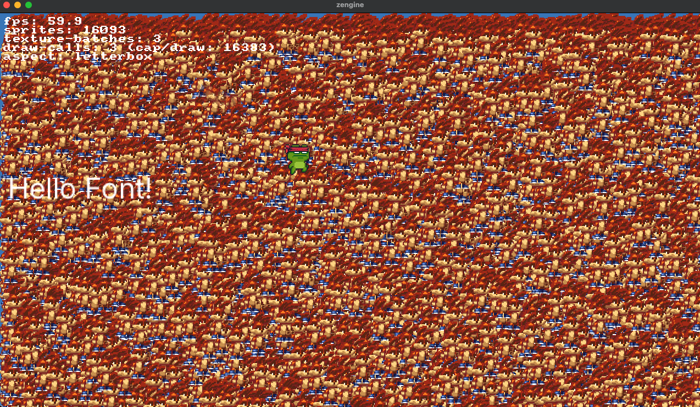

# Zig 2D Game Engine



A proof of concept 2D game engine written in Zig which uses Lua for scripting.

## Features

- Modern cross-platform rendering using [sokol](https://github.com/floooh/sokol)
- ECS style architecture
- Fast sprite rendering with sprite batching and multi texture atlas support
- Virtual resolution support including shaders for crisp pixel art (uses linear filtering but then sharpens in the shader)
- Different aspect modes (letterbox, stretch, crop, fit_width, fit_height)
- Simple 2D camera system
- TrueType font text rendering
- Lua scripting using message passing for game objects
- Basic input handling

## Building

```sh
zig build
```

```sh
zig build run -Doptimize=ReleaseFast  # recommended as not using LuaJit
```

## Lua Script Toggle

### Override script path

```sh
GAME_SCRIPT=assets/scripts/game.lua zig build run -Doptimize=ReleaseFast
```

## Demo

There is a demo in game.lua It shows sprite batching with multiple texture atlases, virtual resolution. 

Press t on the keyboard to add more sprites to the scene.

Press r to enable pixel art shader which uses linear filtering but sharpens in the shader to give crisp pixel art. Press again to disable.

Test the camera with dragging with the mouse or camera zoom in with minus and plus keys.

## TODO

- Hook up the Camera and Text Renderer to Lua
- Add LuaJit
- Collision detection
- More Components and systems
- Tilemap support
- More input handling
- UI system

## Notes

This is pretty rough and not at all ready for production. While it's pretty fast and has some good ideas, I'd recommend using something like Defold or Godot for 2D game development. This is more of a proof of concept to see how far I could get with Zig and Lua using modern game development methods.

I have only tested it on macOS (using Metal for rendering). It should work on Linux and Windows though I haven't tested it. Shaders are compiled using [sokol-shdc](https://github.com/floooh/sokol-tools).

Build scripts are [build.zig](build.zig) and [build.zig.zon](build.zig.zon).

